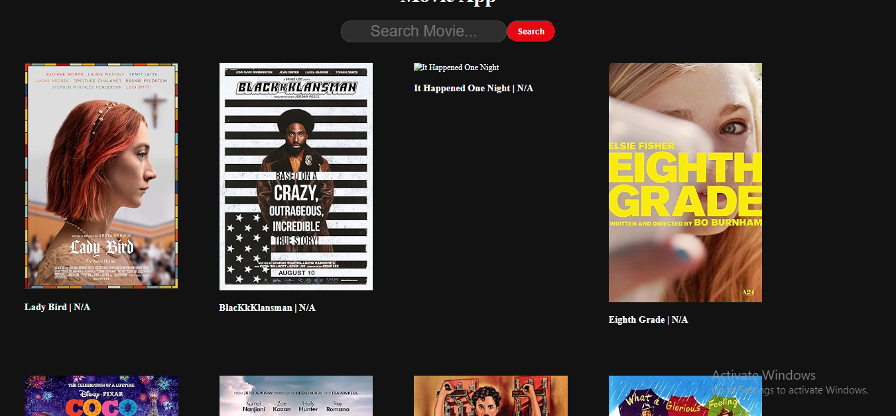

# 🎥 Movie Poster App

Welcome to the **Movie Poster App** built with **React JS**! This project allows users to explore a wide range of movies and view their posters, ratings, and release years.  
It's fast, lightweight, and powered by a **free public API** — no API key required! 🔥

---

## 🌟 Features

✅ Fetches movies dynamically from API  
✅ Search movies by title 🎯 
✅ Displays poster, title, year & rating 🖼️  
✅ Clean layout with responsive grid 📱💻  
✅ Fast, simple and perfect for beginners to practice React

---

## 📸 Screenshot

<div align="center">
  
</div>

---

## 🚀 How to Run

1. Clone this repo:
   ```bash
   git clone https://github.com/yourusername/movie-poster-app.git
   cd movie-poster-app
   npm install
   npm start
```
- 🔗 API Used
- This app uses the following free API (no API key needed):

- 🎬 Sample APIs Movie Endpoint
- https://api.sampleapis.com/movies/action-adventure
or
- https://api.sampleapis.com/movies/comedy

- 👨‍💻 Author
- Made with ❤️ by Majid Ali


- 📦 Folder Structure
- 📁 src/
-   ┣ 📄 App.jsx
-   ┣ 📄 index.js
-   ┣ 📄 MovieApp.css
- 📄 README.md
- 🤝 Support
- If you like this project, consider giving it a ⭐ on GitHub.
- Pull requests and suggestions are always welcome!


